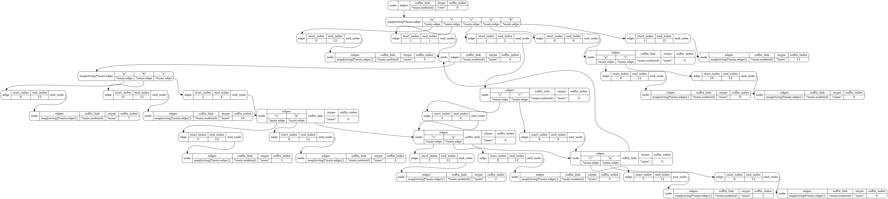

## Local alignment search using suffix tree

Note: Written in GOLANG, to download go for your operating system, visit [golang.org](https://golang.org/)

### Installation

The code depends on the [memviz](http://github.com/bradleyjkemp/memviz) package for visualizing data structures in memory as graphViz plots.

```
> go get github.com/bradleyjkemp/memviz
```

### Build

```
> cd suffixTree
> go build
```

This will generate a binary `./suffixTree`

### Usage

The binary generated from the previous step takes two arguments

- Text to build the suffix tree
- Query string to search

#### Building a Suffix Tree from text

```
> ./suffixTree mississippi
```

This prints a graphViz representation of the suffix tree. Install [GraphViz](https://graphviz.org/) or use [webgraphviz](http://www.webgraphviz.com/) to plot. If you have graphViz installed locally -

```
> ./suffixTree mississippi | dot -Tpng -o graph.png
```



#### Search the suffix tree for a query string

The second argument to the suffix tree is the query string and will print all index positions where the string matches

```
> ./suffixTree mississippi issip
```

Note:

- can/might have bugs (yet to find one)
- has too many print statements (commented out)

After the output of the search of a query string Q in the suffix tree created from text T, use the Python code `extend_max_match.py` to extend the maximum exact match to obtain a local alignment. The script is written in [Python3](https://www.python.org/).

The script accepts all exact matches between Q and T, and builds a heuristic local alignment that is centered around the maximum exact match. Each line in the input file is formatted as: `[<length of match> <index in Q> <indices in T>]`. All suffixes of the query string are matched and the longest exact matches are listed in the input.

Run the Python script as:
```
 > Python3 extend_max_match.py input_file.txt
 ```
